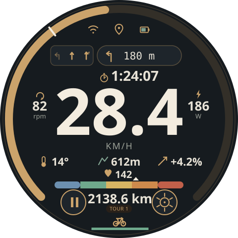
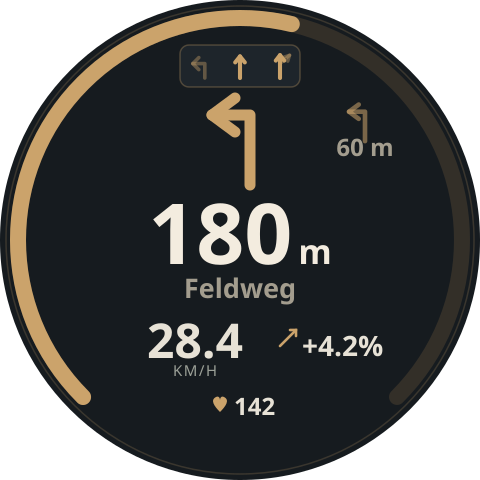

# T-RGB Bike Computer

A bike computer built on the [LilyGO T-RGB](https://www.lilygo.cc/products/t-rgb): a round
480×480 touch display, ESP32-S3 with BLE and WiFi, SD card, and a LiPo charger on board.
It reads standard BLE bike sensors, shows turn-by-turn navigation from your phone, logs
every ride to SD card and rates the road surface with its own accelerometer.

<p>
  
  
</p>

## Features

**Display** -- "Rim & Ridge" UI (LVGL 8, designed in EEZ Studio)
- Main screen: speed with average marker on the outer ring, cadence, temperature,
  altitude, gradient, heart rate with zone band, distance, ride time/clock,
  driving state (pedalling / coasting / stopped / break), road-quality indicator,
  status icons for WiFi, GPS fix and battery
- Navigation screen: opens by itself when the next maneuver comes close, closes after
  it. Shows large turn arrow, distance ring, street name, next maneuver, lane guidance
  and roundabout exits
- Tap the nav pill to open it manually, swipe right to close it

**Sensors**
- BLE: cycling speed & cadence (CSC), heart rate, battery level of each sensor;
  sensors are paired once and locked to their address
- I²C: BME280 (barometric altitude and gradient, temperature), BMI160 accelerometer
- [Forumslader](https://www.forumslader.de/) hub-dynamo charger via my
  [BLE gateway](https://github.com/euphi/ESP32_FLClassic2BLE) (build variant `-FL`)

**Navigation and GPS** from the Android companion app
[TrailBridge](https://github.com/euphi/TrailBridge), which forwards OsmAnd's
turn-by-turn instructions and the phone's GPS position over BLE
([protocol](https://github.com/euphi/TrailBridge/blob/main/PROTOCOL.md)).

**Road quality** from the BMI160 at 400 Hz: roughness class per interval, shock
detection (with second peak from the rear wheel), a calibration ride on smooth
asphalt, and gradient from the accelerometer as an alternative to the barometer.

**Logging**
- Binary ride log on SD card: ride data every 5 s incl. GPS, road quality per
  interval, every shock; raw accelerometer captures on demand
- Debug log and raw Forumslader log (replayable on the device)
- [`Tools/`](Tools/README.md): Python CLI to convert logs to CSV and GPX (sensor data
  as Garmin TrackPointExtension, shocks as waypoints) and a small upload/archive
  service

**Web interface** (when on WiFi)
- Download, replay and delete log files; live log with adjustable log levels
- Ride statistics and charts, odometer and wheel calibration
- Manage BLE sensors, sensor and accelerometer debug pages, calibration
- Firmware and filesystem update over the air

**Serial console**: log levels, memory/stack report (`mem`), road-quality settings
(`rq`), log replay.

## Hardware

- LilyGO T-RGB (the two builds differ in the touch controller variant, `TRGB_ROUND` /
  `TRGB_OVAL`, and in Forumslader support)
- Optional: BME280 and BMI160 on the I²C bus
- LiPo battery
- 3D-printed case and handlebar mounts -- a parametric model for the Canyon CP0007
  gravel cockpit is in [`cad/`](cad/)


## Build

[PlatformIO](https://platformio.org/), Arduino framework (pioarduino platform):

```bash
pio run -e trgb-esp32-s3 -t upload        # default: BLE + I²C sensors
pio run -e trgb-esp32-s3-FL -t upload     # Forumslader variant
pio run -e trgb-esp32-s3 -t uploadfs      # web interface files (data/site)
```

The build applies small patches to two libraries (`apply_patches.py`), which needs
the `patch` tool.

## Documentation

- [ROADMAP.md](ROADMAP.md) -- open work and ideas
- [doc/PITFALLS.md](doc/PITFALLS.md) -- hardware and framework pitfalls (PSRAM and
  display flicker, NimBLE, internal heap, ...) -- German
- [doc/design/rim-ridge-design-system.md](doc/design/rim-ridge-design-system.md) -- UI
  design system -- German
- [doc/DEBUG.md](doc/DEBUG.md) -- logging and core dumps
- [Tools/README.md](Tools/README.md) -- log format and tools -- German

Contributions are welcome, see the roadmap for where help is wanted.

## Licences and attributions

- [Cycling icons created by Futuer - Flaticon](https://www.flaticon.com/free-icons/cycling)
- [Parked bicycles - icon by Prashanth Rapolu 15](https://de.freepik.com/icon/fahrrad_7764338#fromView=resource_detail&position=7)
