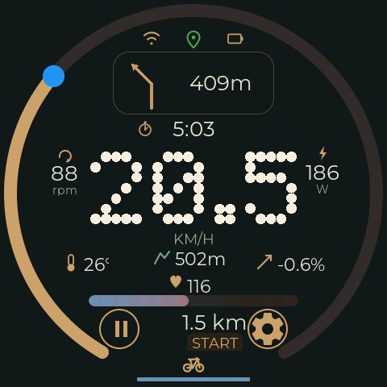
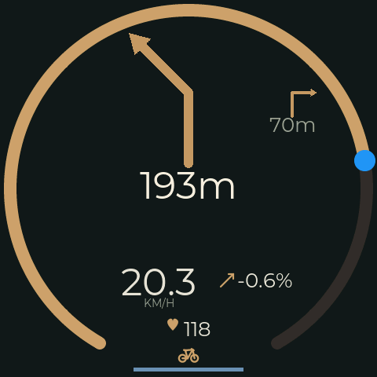
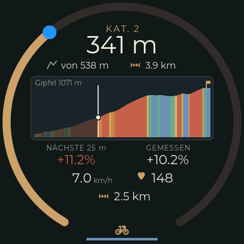
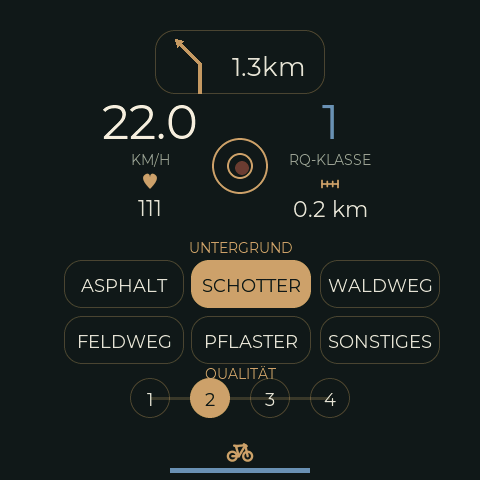
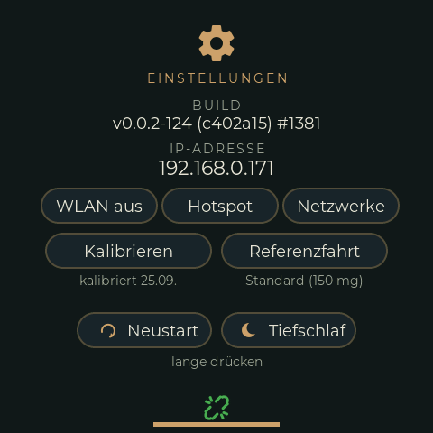
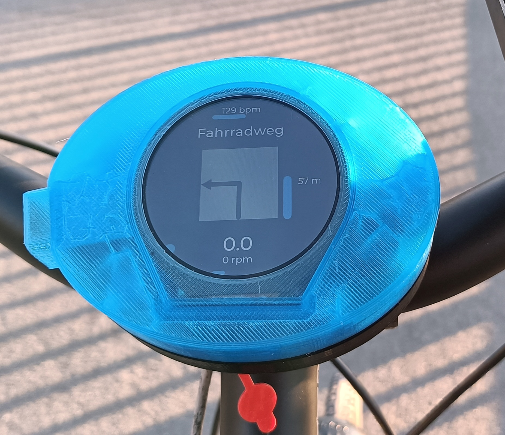

# T-RGB Bike Computer

A bike computer built on the [LilyGO T-RGB](https://www.lilygo.cc/products/t-rgb): a round
480×480 touch display, ESP32-S3 with BLE and WiFi, SD card, and a LiPo charger on board.
It reads standard BLE bike sensors, shows turn-by-turn navigation and the climb ahead
from your phone, logs every ride to SD card and rates the road surface with its own
accelerometer.

<p>
  
  
  
</p>
<p>
  
  
</p>

Screenshots from the device, taken during a simulated ride: main screen, navigation,
climb, road labels, settings.

**Documentation in English and German: <https://euphi.github.io/TRGB-BikeComputer/>**

<!-- features-start -->
## Features

**Display** -- "Rim & Ridge" UI (LVGL 8, designed in EEZ Studio) with five screens:
- **Main**: speed (number and outer ring), cadence, heart rate with zone band,
  temperature, altitude, gradient, distance (ride / trip / tour / total), ride time or
  clock, driving state, road-quality line, status icons for WiFi, GPS fix and battery
- **Navigation**: opens by itself before a maneuver and closes after it. Large turn
  arrow, distance ring, street name, next maneuver, lane guidance, roundabout exits
- **Climb**: elevation profile of the climb ahead, coloured by gradient, with its
  category; opens by itself at the foot of a rated climb ([doc/CLIMB.md](doc/CLIMB.md))
- **Road labels**: mark surface and quality by hand while riding, as ground truth for
  the automatic road-quality class
- **Settings**: a hub with one page per group -- WiFi (IP address, on/off, hotspot, network
  setup with the display keyboard), IMU (calibration and reference ride), height (three
  presets, GPS, manual height or sea-level pressure, [doc/HEIGHT.md](doc/HEIGHT.md)), BLE devices
  (speed, cadence, heart rate, TrailBridge, Forumslader in the FL build: colour = connection,
  battery level; long press forgets a sensor so another one can pair) -- plus
  restart, power off, and a mark for simulator builds

**Rides and statistics**
- One button starts a ride, pauses it ("cruise") and ends it; stops and breaks are
  detected from the speed
- Distance, time, average and maximum speed and average cadence per ride, trip, tour
  and in total; averages with or without stops, breaks and cruise time
  ([doc/design/ride-state-machine.md](doc/design/ride-state-machine.md))

**Sensors**
- BLE: cycling speed & cadence (CSC), heart rate, battery level of each sensor;
  sensors are paired once and locked to their address
- I²C: BME280 (barometric altitude and gradient, temperature), BMI160 accelerometer
- [Forumslader](https://www.forumslader.de/) hub-dynamo charger via my
  [BLE gateway](https://github.com/euphi/ESP32_FLClassic2BLE) (build variant `-FL`)

**Navigation and GPS** from the Android companion app
[TrailBridge](https://github.com/euphi/TrailBridge) over BLE
([protocol](https://github.com/euphi/TrailBridge/blob/main/PROTOCOL.md)):
- Turn-by-turn instructions from OsmAnd, or from a GPX route that TrailBridge plays
  itself -- then with the elevation profile for the climb screen
- The phone's GPS position for the log, and its time for the clock when there is no WiFi
- [`Tools/gpxenrich`](https://github.com/euphi/TRGB-BikeComputer/tree/main/Tools/gpxenrich) turns a plain GPX track into such a route
  (turn hints from BRouter)

**Road quality** from the BMI160 at 400 Hz: roughness class per interval, shock
detection (with second peak from the rear wheel), a calibration ride on smooth
asphalt, and gradient from the accelerometer as an alternative to the barometer.

**Logging**
- Binary ride log on SD card, one session per boot in dated folders: ride data every
  5 s incl. GPS, road quality per interval, every shock, manual road labels, ride
  states; raw accelerometer captures on demand
- Debug log and raw Forumslader log (replayable on the device)
- Python [tools](doc/TOOLS.md) to convert logs to CSV and GPX, and a
  [service](doc/LOGSERVICE.md) that fetches the sessions when the bike
  computer shows up in the WiFi, archives them, exports GPX, syncs to Nextcloud and
  uploads to Komoot
- Session report: all key figures of a ride (climbs, heart-rate zones, TRIMP, estimated
  power, road quality, sensor dropouts and other technical findings) as a web page,
  Markdown or JSON
- Training analysis in the log service, in the Rim & Ridge design: fitness, fatigue and
  form over time, weeks by heart-rate zone, target events with countdown, training phase
  and the course's climbs, best times on recurring climbs

**Web interface** (when on WiFi)
- Download, replay and delete log files; live log with adjustable log levels
- Ride statistics with a chart, odometer and wheel calibration
- Manage BLE sensors; debug pages for sensors, accelerometer, climbs and crashes
- WiFi: saved networks and their priority, hotspot settings ([doc/WIFI.md](doc/WIFI.md))
- Firmware and filesystem update over the air

**Serial console** with line editing, history and Tab completion
([doc/DEBUG.md](doc/DEBUG.md)).

**For development**: a simulator build with fake sensors
([doc/SIMULATOR.md](doc/SIMULATOR.md)), screenshots and touch input over HTTP
(`Tools/uishot.py`), host tests for the pure algorithms (`test/`, `Tools/tests/`).

## Hardware

- LilyGO T-RGB (the two builds differ in the touch controller variant, `TRGB_ROUND` /
  `TRGB_OVAL`, and in Forumslader support)
- Optional: BME280 and BMI160 on the I²C bus
- LiPo battery
- 3D-printed case and handlebar mounts -- a parametric model for the Canyon CP0007
  gravel cockpit is in [`cad/`](https://github.com/euphi/TRGB-BikeComputer/tree/main/cad)



## Build

[PlatformIO](https://platformio.org/), Arduino framework (pioarduino platform):

```bash
pio run -e trgb-esp32-s3 -t upload        # default: BLE + I²C sensors
pio run -e trgb-esp32-s3-FL -t upload     # Forumslader variant
pio run -e trgb-esp32-s3 -t uploadfs      # web interface files (data/site)
```

`trgb-esp32-s3-ota` and `trgb-esp32-s3-FL-ota` are the same builds, uploaded over WiFi
to the device's `/update` endpoint. Target is `TRGB-BC.local`; if mDNS doesn't resolve,
pass the IP: `pio run -e trgb-esp32-s3-ota -t upload --upload-port 192.168.x.y`.
`trgb-esp32-s3-sim` is the simulator build.

The build applies small patches to two libraries (`apply_patches.py`), which needs
the `patch` tool.

<!-- features-end -->

## Documentation

Everything is on <https://euphi.github.io/TRGB-BikeComputer/> in English and German. The
sources are in [`doc/`](doc/): `X.md` is English, `X.de.md` German.

| Document | Content |
|---|---|
| [ROADMAP](doc/ROADMAP.md) | state of the features, known bugs, planned features |
| [USABILITY-TODO](doc/USABILITY-TODO.md) | what is still missing on the device for use on the road |
| [CLIMB](doc/CLIMB.md) | climbs: categories, settings, demo |
| [Ride states](doc/design/ride-state-machine.md) | ride states and how the statistics count |
| [Ride test cheat sheet](doc/RIDE-TEST-CHEATSHEET.md) | what to check on a test ride |
| [Design system](doc/design/rim-ridge-design-system.md) | UI design system and screens |
| [TOOLS](doc/TOOLS.md) | log format, files on the SD card, CLI |
| [LOGSERVICE](doc/LOGSERVICE.md) | log service: fetching, GPX export, Nextcloud, Komoot |
| [DEBUG](doc/DEBUG.md) | debug pages, remote UI testing, logging, serial console, core dumps |
| [SIMULATOR](doc/SIMULATOR.md) | simulator build |
| [PITFALLS](doc/PITFALLS.md) | hardware and framework pitfalls (PSRAM and display flicker, NimBLE, internal heap, ...) |

Contributions are welcome, see the roadmap for where help is wanted.

## Licences and attributions

- [Cycling icons created by Futuer - Flaticon](https://www.flaticon.com/free-icons/cycling)
- [Parked bicycles - icon by Prashanth Rapolu 15](https://de.freepik.com/icon/fahrrad_7764338#fromView=resource_detail&position=7)
