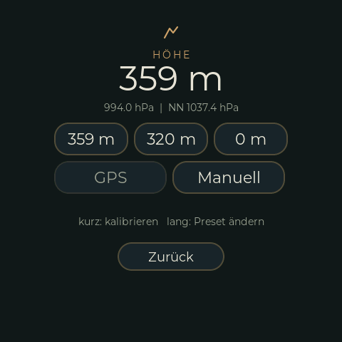

# Höhenkalibrierung

{ width="260" }

Der BME280 misst den Luftdruck; daraus und aus einem **Referenzdruck auf Meereshöhe** (NN, QNH)
wird die Höhe berechnet. Das Wetter verändert diesen Druck, die Höhe driftet also und muss ab und
zu an einem Ort mit bekannter Höhe neu gesetzt werden. Einstellungen → **Höhe**:

| Taste | Wirkung |
|---|---|
| **Drei Presets** (Standard 359 m, 320 m, 0 m) | Tippen: auf die Preset-Höhe kalibrieren. **Lang drücken**: Preset ändern (Zahleneingabe). |
| **GPS** | Kalibriert auf die Höhe über NN des GPS-Fixes von TrailBridge. Die Taste zeigt diese Höhe an („GPS 512 m"). Ausgegraut ohne aktuellen Fix. Ein Handy-GPS ist vertikal nur auf etwa 10 m genau -- ein grober Anfang, kein Ersatz für einen bekannten Ort. |
| **Manuell** | Zahleneingabe: die **bekannte Höhe** (m), oder umschalten auf den **Referenzdruck auf NN** (hPa, 850 bis 1090), z. B. aus dem Wetterbericht. |

Die Seite zeigt Höhe, gemessenen Druck und Referenzdruck. Das Ergebnis der letzten Aktion steht
einige Sekunden unter den Tasten.

## Webseite

`/sensor/` kann dasselbe: Presets (Taste und Feld zum Ändern), GPS, bekannte Höhe und
Referenzdruck. Die Routen gehen auch aus Skripten (`GET`, Antwort `OK` oder der Grund):

```
/sensor/cal?preset=0..2     /sensor/cal?gps=1
/sensor/cal?height=<m>      /sensor/cal?qnh=<hPa>
/sensor/preset?i=0..2&height=<m>
```

## Hinweise

- Referenzdruck und Presets liegen als ein NVS-Blob (`Sensors/HeightCal`); geschrieben wird beim
  nächsten BME280-Takt, nicht vom Aufrufer. Der alte Einzelwert (`RefPressure`) wird noch gelesen.
- Die GPS-Höhe braucht den Tag `MSL_ALTITUDE_DM` (0x0E) des [Protokolls](trailbridge/PROTOCOL.md)
  und Android 14 oder neuer. `ALTITUDE_M` gilt über dem Ellipsoid (in Deutschland rund 47 m
  daneben) und wird **nicht** benutzt. Erfundene Positionen (GPX-Testfahrt) werden abgelehnt.
- Code: `I2CSensors::calibrateHeight()` und Verwandte, Anzeige `src/ui/RimRidgeAltCustFunc.*`
  (EEZ-Seiten `RimRidgeSettingsAlt`, `RimRidgeSettingsNum`), Web-Routen in `src/WifiWebserver.cpp`.
