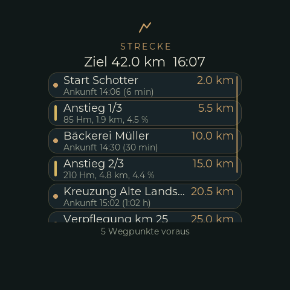

# Route overview: destination, waypoints and climbs

When TrailBridge plays a GPX route, it also tells the bike computer what is still **ahead on
the route**: the destination, the waypoints of the GPX file (`wpt`, e.g. summit, feed zone,
gravel sector) and the climbs of the whole route ([protocol](trailbridge/PROTOCOL.md), "route
overview service"). The bike computer shows them as one list on the screen `RimRidgeRoute`.

{ width="260" }

The picture is rendered on the host with the real LVGL and the demo route (`route demo`, see
below), not a photo of the device.

| Part | File |
|---|---|
| Wire format | `src/BikeOverviewProtocol.h` (and `OVERVIEW_REVISION` in `src/BikeNavProtocol.h`) |
| Parser, distances and times (pure, host test) | `src/RouteOverview.*`, `test/native_routeoverview/routeoverview_test.cpp` |
| Integration: BLE read, position, CLI, web, demo | `src/RouteMonitor.*`, `BLEDevices::findOverview()`/`overviewReaderTask()` |
| Screen | `src/ui/RimRidgeRouteCustFunc.*`, `UIFacade::showRouteScreen()` |

## Using it

- **Open**: swipe **to the left** on the navigation screen. That counts as dismissing the
  navigation screen, as with the road-quality screen; the next maneuver brings it up again.
- **Close**: any swipe on the route screen goes back.
- **Scroll**: the list scrolls vertically; the nearest entry is on top.

The heading shows the **destination** with the distance left and the **arrival time**. Below
it, waypoints and climbs are mixed in the order in which the rider reaches them (a climb counts
at its foot):

| Row | Left | Right | Second line |
|---|---|---|---|
| Waypoint (dot) | name | distance | arrival time and time left, e.g. `Ankunft 14:32 (18 min)` |
| Climb (bar in the colour of its mean gradient) | `Anstieg 2/7` | distance to the foot; once the rider is in it `noch 2.8 km` to the summit | height gain, length, mean gradient, e.g. `450 Hm, 8.2 km, 5.5 %` |

The colour of a climb's bar follows the same gradient bands as the profile on the
[climb screen](CLIMB.md). Waypoints and climbs fall out of the list when they are reached.
The footer says how many waypoints are ahead, and "Liste gekürzt" if the list is cut at the
far end (see below). Without a route the screen says "Keine Strecke".

## Where distances and times come from

The phone does not send distances but **anchors**: for every waypoint the remaining route
distance (and time) *at that waypoint*. The bike computer subtracts them from the last nav
frame, so the list needs no new transfer while the rider rides:

```
distance = REMAINING_DISTANCE_M - REMAINING_AT_M            (negative: reached)
time     = REMAINING_TIME_S - REMAINING_TIME_AT_S           (GPX has timestamps)
time     = REMAINING_TIME_S * distance / REMAINING_DISTANCE_M    (it has not)
```

Between two nav frames the distance is carried on with the wheel sensor, as for the climb
screen; the time is that of the last frame, so the arrival clock time does not creep. The
arrival time is the clock plus the time left; without a valid clock the screen shows only the
time left.

Which of the two time formulas applies is decided by the GPX file: with timestamps (a recorded
ride, or a planned route whose router writes its estimate -- BRouter only does with
`assign showtime = true`) the times come from the file and know the climbs. Without them
TrailBridge divides the distance by the current speed, which is too optimistic before a long
climb. Climbs have no time.

## How it is read

The service is **read only**. The signal "there is something new" is the tag
`OVERVIEW_REVISION` in every nav frame: if it differs from the revision of the overview held,
the characteristic is read -- a long read of up to 512 byte. That happens in a task of its own
(`BLEOverview`), never in the indicate callback (a long read blocks) and not in the scan task
(which sleeps 20 s between rounds). A nav frame without the tag (navigation from OsmAnd),
`NAV_NONE` or a lost connection drops the overview. A read that fails is retried after 4 s.

A new overview comes when the route starts, when a waypoint is reached and at every summit --
a few dozen reads on a ride. In between the list is only recomputed.

## Limits

- A frame is 512 byte at most. If more waypoints and climbs are ahead than fit, TrailBridge
  leaves out the far end; it moves up as the near ones are reached. The firmware keeps 48
  entries and shows the nearest 24.
- Names are 32 byte of UTF-8. The display fonts have ASCII, `äöüÄÖÜß` and `°`; other
  characters are not drawn.
- Missing: the **height still to climb** of a climb that is already begun. It needs a protocol
  extension (TrailBridge roadmap).
- **Not yet tried on the device**, in particular the long read over a real connection (read
  from the BLE library's source, not tested). Host test, simulator build and a host rendering
  of the screen exist.

## Demo and debugging

To see the screen without a phone (the demo route is 42 km with five waypoints and three
climbs, driven at 20 km/h; frames from the phone are ignored while it runs):

```
route demo            # start; the rider moves with the wheel sensor
route pos 25000       # rider 25 km from the start (in the second climb)
route show            # open the screen (swipe closes it)
route status          # the list as the screen gets it
route demo off
```

On the web: `/debug/route.json` (state and list), `/debug/route/demo` (`?off=1`, `?pos=<m>`).
Host test: `g++ -std=c++17 -O2 -Isrc src/RouteOverview.cpp test/native_routeoverview/routeoverview_test.cpp -o /tmp/routeoverview_test && /tmp/routeoverview_test`
(the build command is in the file header). TrailBridge's GPX test ride sends the real thing,
without a ride.
