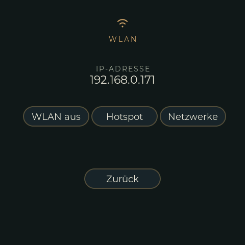
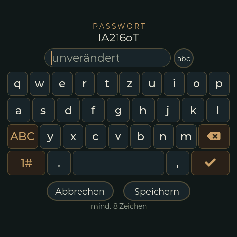

# WLAN

Der Fahrradcomputer verbindet sich selbst mit bekannten Netzen, kann einen eigenen Hotspot
öffnen und wird entweder am Display oder auf einer Webseite eingerichtet. In der Firmware
steht kein Netzname und kein Passwort.

{ width="260" }

## Einstellungs-Screen (WLAN-Seite)

Einstellungen → **WLAN**:

| Taste | Tut |
|---|---|
| **WLAN an / aus** | Schaltet das WLAN ein (automatische Verbindung, siehe unten) oder aus. Nachdem sich das WLAN selbst abgeschaltet hat, ist das der einzige Weg zurück. |
| **Hotspot / Hotspot aus** | Startet oder beendet den Hotspot (Standardname `TRGB-BC`). Solange er läuft, steht sein Passwort statt der IP-Adresse auf dem Screen. |
| **Netzwerke** | Öffnet den WLAN-Screen: suchen, Netz auswählen, Passwort tippen. |

Die Zeile über den Tasten zeigt die IP-Adresse oder warum das WLAN aus ist („kein WLAN
gefunden", „Verbindung verloren", „kein Netz gespeichert", ...).

## Netz am Display einrichten

1. Einstellungen → WLAN → **Netzwerke** → **Suchen**. Die Netze in Reichweite stehen in der Liste,
   das stärkste oben; schon gespeicherte sind messingfarben. Eine Suche schaltet das WLAN ein,
   wenn es aus war.
2. Netz antippen. Der Passwort-Screen öffnet sich: Passwort auf der Tastatur tippen (**abc**
   zeigt oder verbirgt es, **1#** und **#+=** sind die Sonderzeichen-Seiten, die Umschalttaste
   gilt nur für einen Buchstaben). Bleibt das Feld bei einem gespeicherten Netz leer, bleibt
   das alte Passwort. WPA2 braucht 8 bis 63 Zeichen.
3. **Speichern** legt es im NVS ab und verbindet, wenn das WLAN aus ist.

{ width="260" }

Die Reihenfolge der gespeicherten Netze (ihre Priorität) und das Löschen gehen nur auf der
Webseite.

## Webseite `/wifi`

Verlinkt von der Startseite („WiFi Settings"). Sie zeigt

- den Zustand (verbunden mit ..., Hotspot, ...),
- die gespeicherten Netze mit ▲ ▼ (Priorität), **Edit** (Passwort) und **Delete**,
- eine Suche mit Auswahlliste oder eine SSID von Hand (auch für versteckte und offene
  Netze),
- Name und neues Passwort des Hotspots.

Es werden bis zu 8 Netze gespeichert. Passwörter werden nie an die Seite zurückgeschickt oder
ins Log geschrieben; im NVS liegen sie im Klartext, wie bei jeder ESP32-Firmware ohne
Flash-Verschlüsselung.

## Automatische Verbindung und die 5 Minuten

Nach dem Booten und wann immer das WLAN eingeschaltet wird, sucht das Gerät und probiert die
gespeicherten Netze in Reichweite **in der Reihenfolge der Liste**, je 15 s (versteckte werden
ungesehen probiert). Klappt keins, sucht es alle 15 s erneut. Besteht **5 Minuten** keine
Verbindung (nie verbunden oder Verbindung verloren), schaltet sich das WLAN zum Stromsparen
ab. Eine Suche dauert etwa 10 s, solange BLE läuft.

Für den Hotspot gilt dasselbe: er endet 5 Minuten, nachdem der letzte Client weg ist (oder
nach dem Start, wenn keiner kam).

Ist kein Netz gespeichert, bleibt das WLAN nach dem Booten aus.

## Hotspot

SSID `TRGB-BC`, wenn nicht geändert, WPA2. Das Passwort wird beim ersten Start erzeugt (10
Zeichen) und steht auf dem Einstellungs-Screen, solange der Hotspot läuft; die Webseite kann
ein neues setzen. Adresse `192.168.4.1` (und `TRGB-BC.local`). Bis zu 4 Clients.

Der Hotspot ist ein Captive Portal: Er beantwortet jeden Namen mit seiner eigenen Adresse und
leitet jede unbekannte URL auf `/wifi` um. Android und iOS öffnen die Seite dann von selbst
und nutzen dafür den Hotspot, obwohl er kein Internet hat -- ohne das bliebe ein Handy mit
Mobilfunk beim Mobilfunk und käme nie an `192.168.4.1`.

Solange der Hotspot läuft, sind etwa 14 KB weniger interner Heap frei (siehe
[Fallstricke](PITFALLS.md)).

## Serielle Konsole

`wifi [status|on|off|ap [on|off]|scan|list|add <ssid> <passwort>|del <ssid>|apset <ssid> <passwort>]`,
siehe [Debugging](DEBUG.md). Nützlich für die erste Einrichtung ohne Display.

## Code

| Teil | Datei |
|---|---|
| Netzliste, Hotspot-Daten, NVS-Blob, Reihenfolge der Verbindung (Host-Test `test/native_wificonfig/`) | `src/WifiConfig.*` |
| Zustandsautomat, Suche, Hotspot, CLI | `src/WifiWebserver.cpp` |
| Seite `/wifi` und JSON-Schnittstelle | `src/WifiRoutes.cpp` |
| Display: Liste, Passwort-Screen, Tastatur | `src/ui/RimRidgeWifiCustFunc.*`, EEZ-Seiten `RimRidgeWifi`, `RimRidgeWifiPw` |
| Pillen der Einstellungen | `src/ui/RimRidgeSettingsCustFunc.cpp` |
