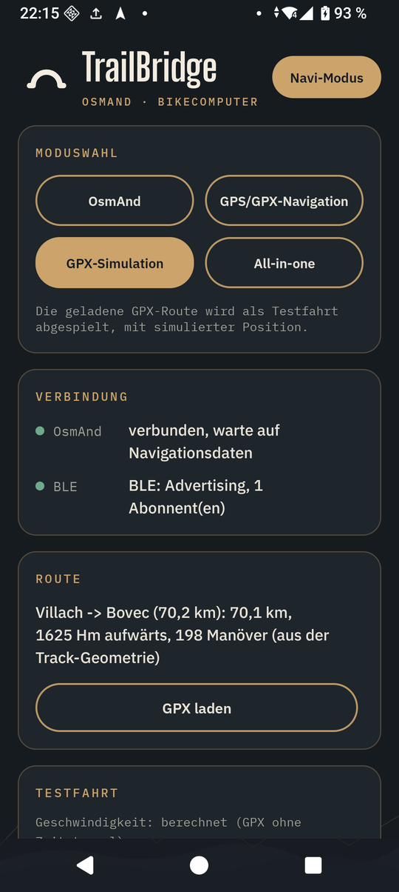
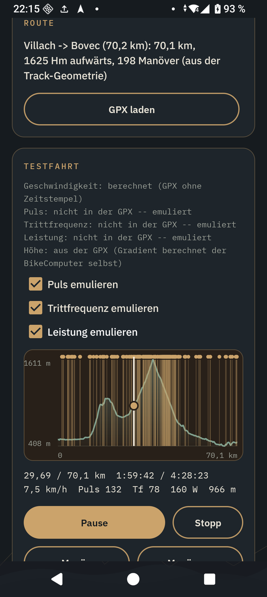
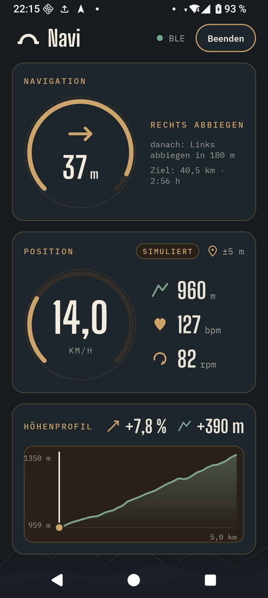

# TrailBridge

[TrailBridge](https://github.com/euphi/TrailBridge) is the Android companion app of the
bike computer. It passes navigation, GPS position and the elevation profile of the next
climb to the bike computer over BLE -- as a replacement for Komoot's discontinued BLE
navigation service.

<figure markdown><figcaption>Mode, connection, route</figcaption></figure>
<figure markdown><figcaption>Test ride</figcaption></figure>
<figure markdown><figcaption>Navi mode</figcaption></figure>

The app's texts are German.

## What it does

- **Navigation from OsmAnd**: reads OsmAnd's turn-by-turn navigation through its AIDL
  API (maneuver, street names, the maneuver after next, lanes, remaining distance and
  time) and sends it as a compact TLV protocol over BLE -- see the
  [BLE protocol](PROTOCOL.md).
- **GPS position**: a second, independent BLE service with the phone's raw GPS position,
  straight from the GPS chip. It works without OsmAnd, goes into the bike computer's
  ride log and sets its clock when there is no WiFi.
- **GPX routes**: open, share or load a GPX file and start the route -- TrailBridge then
  navigates itself (GPS position matched onto the route, no OsmAnd needed) and sends the
  same navigation frames. Turn hints come from the file (`rtept`, OsmAnd route segments),
  otherwise from the geometry of the track.
- **Climbs**: if the route has elevation data, the elevation profile of every climb goes
  out shortly before it (500 m before its foot), up to the summit -- also for long passes
  in one piece. The bike computer shows it on its [climb screen](../CLIMB.md).
- **Test ride**: the loaded GPX route can be "played" for testing. TrailBridge then sends
  a made-up position along the route instead of the real one -- with a matching speed
  (from the GPX timestamps, otherwise computed: slower uphill, faster downhill, careful
  in bends), heart rate, cadence and power (from the GPX, otherwise emulated on request)
  and the altitude of the route. An elevation profile with maneuver markers lets you jump
  back and forth. Only the bike computer's [simulator build](../SIMULATOR.md) evaluates
  the sensor values; they are marked as simulated in the protocol.
- **Navi mode**: a reduced screen for the road -- only navigation, position and, while
  one has been sent to the bike computer, the elevation profile of the climb ahead. The
  screen stays on.

## Modes

| Mode | What runs |
|---|---|
| OsmAnd | navigation from OsmAnd, real GPS position |
| GPS/GPX navigation | TrailBridge navigates along the loaded GPX route, real GPS position |
| GPX simulation | the loaded GPX route is played as a test ride with a simulated position |
| All-in-one | everything on one screen: OsmAnd, GPX navigation and simulation |

## Getting started

1. Install OsmAnd and load an offline map for your area.
2. Install TrailBridge ([releases](https://github.com/euphi/TrailBridge/releases)) and
   open it. The status shows that it is not enabled in OsmAnd yet.
3. In OsmAnd: Menu > Plugins > TrailBridge > enable.
4. Back in TrailBridge the status becomes "verbunden, warte auf Navigationsdaten"
   (connected, waiting for navigation data).
5. Start a route in OsmAnd -- or load a GPX file in TrailBridge and start it there.

The bike computer finds TrailBridge by itself: it scans for the navigation service and
connects to the first phone that advertises it.

### Test ride

1. Load a GPX file and open the test ride panel with the elevation profile.
2. It shows where speed, heart rate and cadence come from (the GPX or not available);
   where they are missing, they can be emulated with a checkbox.
3. "Abspielen" (play) starts the ride at the beginning or at the position chosen last;
   navigation starts by itself. Tapping or dragging in the elevation profile jumps to
   that place, "« Manöver" / "Manöver »" jumps 400 m before the previous/next maneuver.
   "Stopp" ends the test ride, the real GPS fix applies again.
4. It runs in real time.

Without a bike computer the BLE part can be checked with any BLE scanner app, e.g. nRF
Connect -- UUIDs and frame format are in the [BLE protocol](PROTOCOL.md).

## More

- Source code, building, design and licence:
  [github.com/euphi/TrailBridge](https://github.com/euphi/TrailBridge) (German)
- TrailBridge is licensed under the GPL-3.0-or-later.
